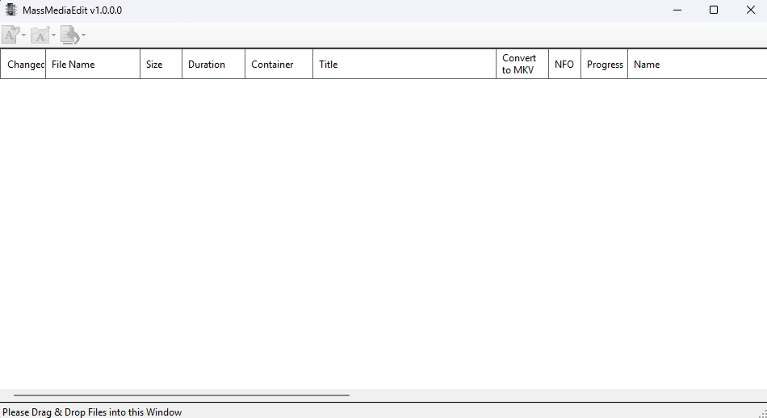

# MassMediaEdit

[](https://licenses.nuget.org/LGPL-3.0-or-later)

[](https://github.com/Hawkynt/MassMediaEdit/actions/workflows/NewBuild.yml)
[](https://github.com/Hawkynt/MassMediaEdit/actions/workflows/Tests.yml)
[ ](https://github.com/Hawkynt/MassMediaEdit/commits/master)

 /
 
[](https://github.com/Hawkynt/MassMediaEdit/stargazers)
[](https://github.com/Hawkynt/MassMediaEdit/releases/latest)


> **MassMediaEdit** is a Windows Forms application designed for batch editing and managing media files. This tool provides various functionalities to streamline the organization and manipulation of media files, including support for different media formats and metadata editing.

## Download

Get the latest release from the [Releases page](https://github.com/Hawkynt/MassMediaEdit/releases/latest).

### System Requirements

- Windows 10 or later
- [.NET 8.0 Runtime](https://dotnet.microsoft.com/en-us/download/dotnet/8.0)

## Features

- **High Performance Loading**: Optimized for handling large media collections
  - Producer/consumer architecture with parallel MediaInfo processing
  - Batch processing reduces process spawn overhead (20 files per MediaInfo call)
  - Smart file filtering by extension before processing
  - Live progress display during loading ("15/70+" during discovery, "60/60" when complete)
- **Batch Media File Editing**: Quickly and efficiently edit multiple media files at once
- **Metadata Management**: Modify and update media file metadata including:
  - Video stream names and 3D mode settings
  - Audio stream language, default track selection
  - Container title information
- **Support for Multiple Formats**: Works with various media formats including MP4, MKV, and more
- **Integration with External Tools**: Utilizes industry-standard tools:
  - [MediaInfo](https://github.com/MediaArea/MediaInfo) - Extract detailed media information
  - [MKVToolNix](https://github.com/Kissaki/MKVToolNix) - MKV file manipulation
  - [GPAC](https://github.com/gpac/gpac) - MP4 file operations

## Screenshots

### Main Window


The main window shows a data grid where you can drag and drop media files for batch editing. The toolbar at the top provides quick access to renaming and metadata operations.

## Installation

### Option 1: Download Release (Recommended)

1. Download the latest ZIP from [Releases](https://github.com/Hawkynt/MassMediaEdit/releases/latest)
2. Extract to a folder of your choice
3. Run `MassMediaEdit.exe`

### Option 2: Build from Source

1. Clone the repository:
   ```bash
   git clone https://github.com/Hawkynt/MassMediaEdit.git
   ```

2. Navigate to the project directory:
   ```bash
   cd MassMediaEdit
   ```

3. Build the project:
   ```bash
   dotnet build --configuration Release
   ```

4. Run the application:
   ```bash
   dotnet run --project MassMediaEdit
   ```

## Usage

### Getting Started

1. **Launch the application** - Double-click `MassMediaEdit.exe`
2. **Add media files** - Drag and drop files or folders into the main window
3. **Edit metadata** - Select files and modify properties directly in the data grid (editable fields are highlighted)
4. **Save changes** - Right-click and select "Commit" to apply changes to files

### Main Interface

The application consists of:

**Toolbar** with three dropdown buttons:
- **Rename Files** - Rename files using patterns with placeholders
- **Rename Folders** - Rename parent folders using patterns
- **Tags From Name** - Extract metadata from filenames

**Data Grid** displaying media information:

| Column         | Description                                             |
|----------------|---------------------------------------------------------|
| Changed        | Indicates unsaved modifications (red = pending changes) |
| File Name      | Full path to the media file (double-click to play)      |
| Size           | File size                                               |
| Duration       | Media duration                                          |
| Container      | Container format (MKV, MP4, etc.)                       |
| Title          | Container title metadata (editable for MKV)             |
| Name           | Video stream name (editable for MKV)                    |
| Codec          | Video codec information                                 |
| Width/Height   | Video dimensions in pixels                              |
| Bitrate        | Video bitrate                                           |
| 3D-Mode        | Stereoscopic mode setting (editable for MKV)            |
| Default        | Audio track default flag (checkbox, editable)           |
| Language       | Audio track language (editable for MKV)                 |
| Convert to MKV | Button to convert non-MKV files to MKV format           |
| NFO            | Indicates if an NFO file exists alongside the media     |
| Progress       | Shows conversion progress                               |

**Context Menu** (right-click on selected items):
- **Clear** - Remove all items from the list
- **Remove** - Remove selected items
- **Commit** - Save pending changes to files
- **Revert** - Discard pending changes
- **Audio Stream 1/2** - Set audio track language
- **Convert to MKV** - Convert selected files to MKV format

### Tags From Name Menu

The toolbar's "Tags From Name" dropdown provides:

| Option                  | Action                                       |
|-------------------------|----------------------------------------------|
| Title From Filename     | Set container title from the filename        |
| Name From Filename      | Set video stream name from the filename      |
| Fix Title/Name          | Clean up and normalize title/name            |
| Clear Title             | Remove the container title                   |
| Clear Name              | Remove the video stream name                 |
| Swap Title & Name       | Exchange title and name values               |
| Recover Spaces          | Convert underscores/dots to spaces           |
| Remove Bracket Content  | Strip text within brackets                   |
| From NFO Metadata       | Extract title/name from associated NFO files |
| Auto-Fill from Filename | Apply multiple cleanup operations at once    |

### Supported Operations

- **Batch Rename**: Rename files and folders according to customizable patterns
- **Metadata Editing**: Update container and stream metadata for MKV files
- **Language Assignment**: Set audio track languages (German, English, Spanish, Japanese, French, Russian)
- **Default Track Selection**: Mark audio tracks as default
- **Format Conversion**: Convert MP4 and other formats to MKV
- **NFO Integration**: Extract metadata from Kodi/XBMC NFO files

## Project Structure

```
MassMediaEdit/
├── MassMediaEdit/           # Main WinForms application
│   ├── Classes/             # Core business logic classes
│   ├── Libraries/           # Utility and helper classes
│   ├── Models/              # Data models
│   ├── Presenters/          # MVP presenters
│   ├── Properties/          # Application settings and resources
│   ├── Resources/           # Icons and images
│   └── Tools/               # External tool binaries
├── MassMediaEdit.Tests/     # Unit and integration tests
├── NfoFileFormat/           # NFO file format library
└── NfoFileFormat.Tests/     # NFO library tests
```

## Dependencies

### External Tools (Included)

The application bundles the following tools in the `Tools` directory:

- **GPAC/mp4box.exe** - MP4 file manipulation
- **MediaInfo/MediaInfo-CLI.exe** - Media information extraction
- **MKVToolNix/mkvmerge.exe** - MKV container operations
- **MKVToolNix/mkvpropedit.exe** - MKV property editing

### NuGet Packages

- `FrameworkExtensions.Corlib` - Core library extensions
- `FrameworkExtensions.System.Windows.Forms` - WinForms extensions
- `T4.Build` - T4 template build support

## Contributing

Contributions are welcome! Please:

1. Fork the repository
2. Create a feature branch (`git checkout -b feature/amazing-feature`)
3. Commit your changes (`git commit -m 'Add amazing feature'`)
4. Push to the branch (`git push origin feature/amazing-feature`)
5. Open a Pull Request

See the [contribution guidelines](https://github.com/Hawkynt/MassMediaEdit/blob/master/CONTRIBUTING.md) for more details.

## License

This project is licensed under the LGPL-3.0-or-later License. See the [LICENSE](./LICENSE) file for details.

## Support

- **Issues**: [GitHub Issues](https://github.com/Hawkynt/MassMediaEdit/issues)
- **Discussions**: [GitHub Discussions](https://github.com/Hawkynt/MassMediaEdit/discussions)

---

Made with care by [Hawkynt](https://github.com/Hawkynt)
